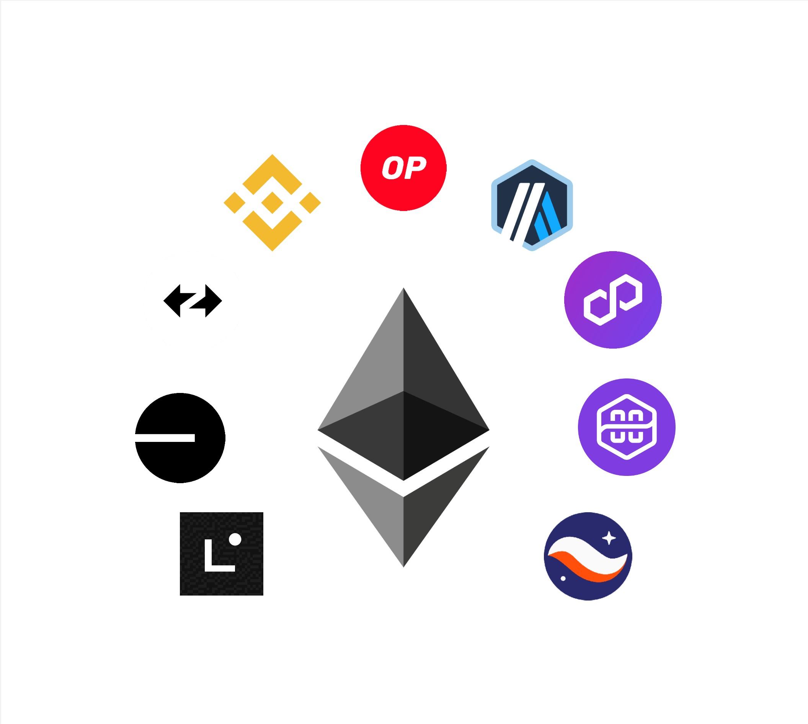
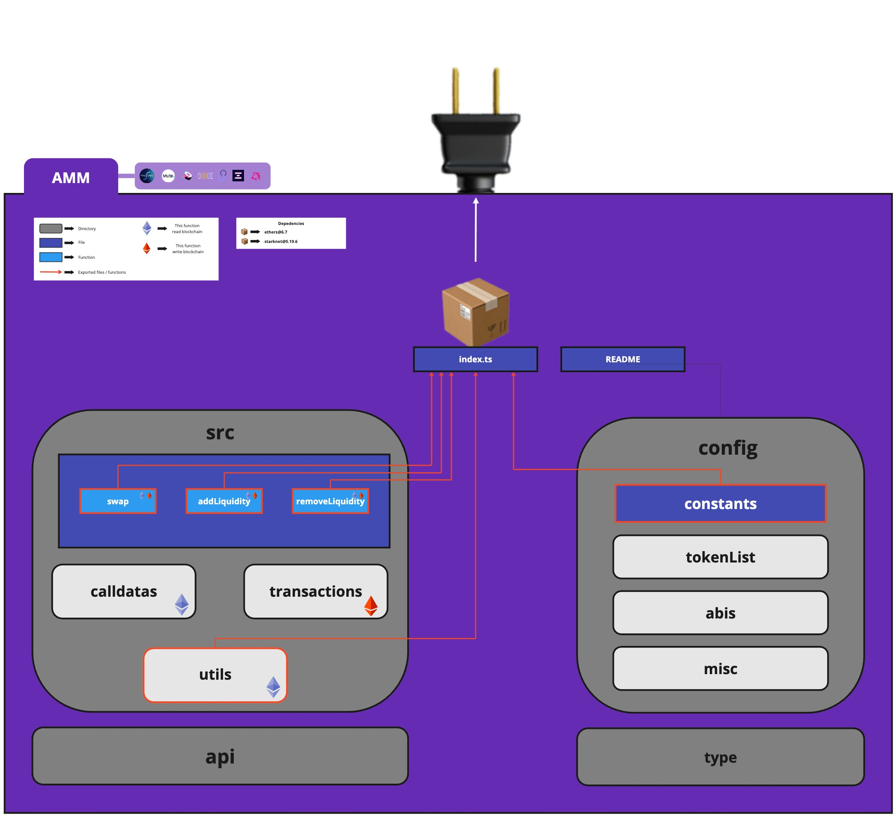
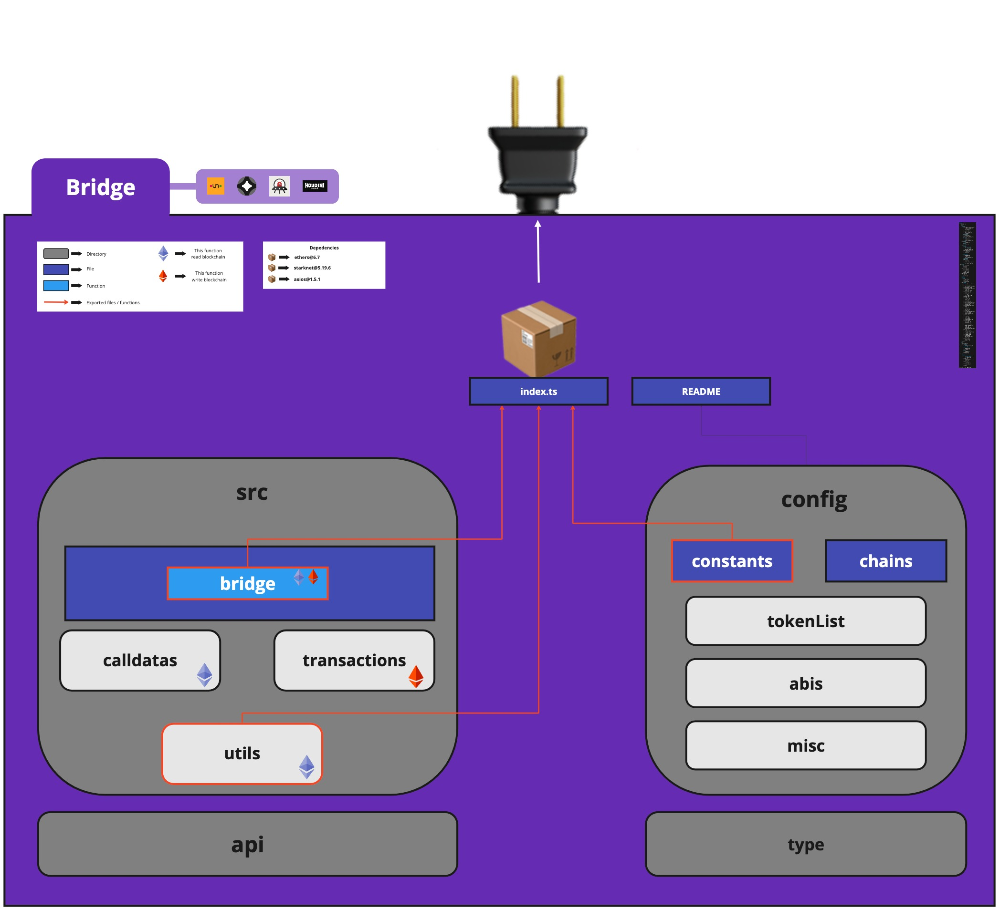
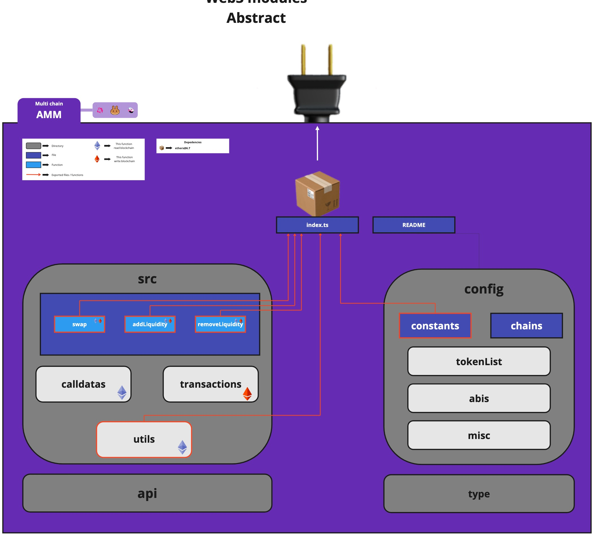

# Lib web3 v1.0.0

 
 
  
## Abstract
  
This library covers several modules that interface with the most important services on *ethereum* and its layer 2 chains below are all the major categories.  
  
You can find a quick documentation on how to use each module in their respective README file.
 
 
 
 

## Automated Market Maker (AMM) 
  
This category include modules that can interact with single chain *Automated Market Maker* smart contracts allowing you to **swap / add liquidity / remove liquidity** on famous protocols  
 

### Module architecture
 
 
 
 
 
  
## Bridge  
  
This category allow to interact with bridges to **bridge** your tokens from one chain to another 
 

### Module architecture
 
 
 
 
 
  
## Multi chain Automated Market Maker (MCAMM)  
  
this catogory include modules that can interact with an *Automated Market Maker* on multiple chains allowing you to **swap / add liquidity / remove liquidity** on famous protocols
 

### Module architecture
 
 
 
